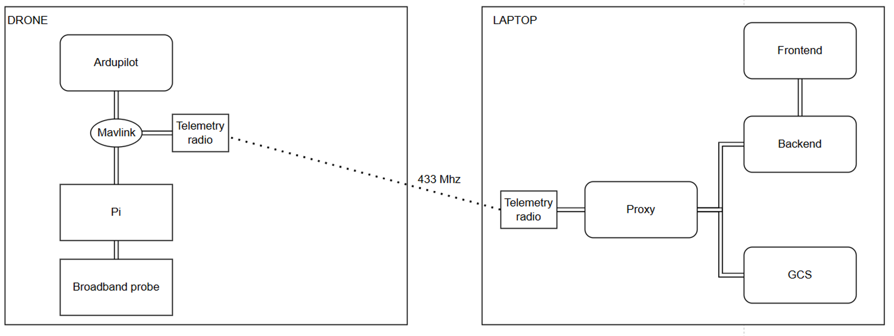

# 📡 ExposiCopter: Drone-Based RF-EMF Measurement Platform

This repository contains all code, configuration files, and visualizations developed for my master's thesis on drone-based RF-EMF (radio-frequency electromagnetic field) mapping. The system integrates a quadcopter with real-time signal acquisition, flight automation, and interference mitigation strategies for robust wireless exposure measurements.

---

## 🚀 Project Overview

The goal of this project is to demonstrate the feasibility of using drones (UAVs) for autonomous RF-EMF measurements in outdoor environments. This includes:

- Developing a drone platform equipped with a broadband RF sensor.
- Designing a signal-cleaning algorithm to remove onboard electromagnetic interference (EMI).
- Performing controlled and in-situ validation flights to measure and map EMF exposure.

---

## 🧰 Features

- 📡 Real-time electric field strength logging (600–6000 MHz).
- ✈️ Autonomous flight missions using ArduPilot and MAVLink.
- 🧹 Signal-cleaning pipeline to suppress EMI from telemetry and internal electronics.
- 📊 Jupyter notebooks for data processing, plotting, and validation.
- 🧪 Includes turntable experiments and outdoor measurements near base stations.

---

## 🖼 System Architecture

 

---

## ⚙️ System Setup

The system consists of three main components:

1. **Raspberry Pi 4 (on the drone)**  
   - Run `companion_computer/pymavlink_hello_world.py` for real-time data acquisition and communication with the flight controller.

2. **Laptop (Ground Station)**  
   - Run the **FastAPI backend** located in `backend/` (manual startup required).
   - Use **Mission Planner** for mission control.
   - Start **MAVProxy** in WSL to forward telemetry between components.
   - Use `automate_everything.ps1` (as administrator) to:
     1. Attach the USB device to WSL.
     2. Launch MAVProxy.
     3. Start Mission Planner.

3. **Optional: Simulated Environment**  
   If you don’t have a physical drone, use `start_sim_local.sh` to start a simulated ArduPilot drone with MAVProxy locally. This allows full system testing in a virtual environment.

---

## 📁 Repository Structure
```bash
├── backend/ # FastAPI backend serving static frontend
│ ├── main.py # Launches backend and serves frontend
│ └── frontend/
│ ├── index.html # Main UI for visualization
│ ├── main.js # JavaScript logic for plots
│ ├── plotly_offline.js # Local copy of Plotly
│ └── assets/ # CSS/JS framework files
├── companion_computer/ # Code running on drone’s companion computer
│ ├── pymavlink_hello_world.py # Main script that runs on the Pi
│ ├── helper_functions.py # Utility functions
│ ├── draaitafel/ # Folder containing code for turntable experiments
│ └── drone_influence/ # Experiments on drone self-interference
├── draaitafel-raw-data/ # Raw data from turntable experiments
├── draaitafel-processed-data/ # Cleaned/processed data from turntable
├── Drone/ # Abstraction layer over pymavlink for drone control
│ └── Drone.py # Exposes high-level drone commands (used by pymavlink_hello_world and backend scripts)
├───flight_logs #contains flightlogs for some flights
├───processed-data/ # processed data from drone interference experiments
├───raw-data/ # Raw data from drone interference experiments
├───raw-flight-data/ # raw flight data from companion computer flights
├───raw-plots/ # drone interference raw data plots
├── architecture.drawio # system architecture
├── attach_usb_wsl.ps1 # script to attach usb device to WSL
├── automate_everything.ps1 # script to automate MP, mavproxy and USB startup
├── requirements.txt # recuirements file
├── RF_analyse.ipynb # notebook use to analyse experiments
├── start_mavproxy.sh # script to automatically start mavproxy server (to be used by automate_everything.ps1)
├── start_sim_local.sh # script to start simulated drone locally 
```
---


## 🏃‍♂️ How to Run
On the Raspberry Pi, run:    
```bash
    python companion_computer/pymavlink_hello_world.py
```
On the laptop, open PowerShell as administrator and run:
```powershell
    .\automate_everything.ps1
```
to start the system, however to run a simulated veriosn of the drone use, 
```bash
    ./start_sim_local.sh [windown_local_ip]
```
to start mavproxy linked with simulated drone.

Then, start the backend manually:
```bash
    uvicorn backend.main:app --reload
```

---

## 🛠 Dependencies

- Python 3.11+
- requirements.txt
---

## 🙏 Acknowledgements

- Supervision: Kenneth, Jeroen, Lowie, and Han — thank you for the technical support and guidance.
- Sparring partner: Jonas
- Friends and family: Thanks for the moral and practical support throughout this thesis.

---

## Note
There are some hardcoded IP addresses and paths in some scripts that have to be adapted to the system