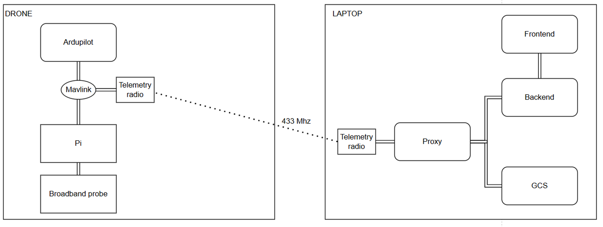

# 📡 ExposiCopter: Drone-Based RF-EMF Measurement Platform

This repository contains all code, configuration files, and visualizations developed for my master's thesis on drone-based RF-EMF (radio-frequency electromagnetic field) mapping. The system integrates a quadcopter with real-time signal acquisition, flight automation, and interference mitigation strategies for robust wireless exposure measurements.

This barnch serves as a guide for future students to understand, set up, and continue the development of this project.

## 📁 Repository Structure
```bash
rtalwar2-exposicopter/
├── README.md                   # This setup and documentation file
├── automate_everything.ps1     # [Windows] Main PowerShell script to automate system startup
├── requirements.txt            # Python dependencies for the project
├── start_sim_local.sh          # [Linux/WSL] Script to start a local drone simulation (SITL)
│
├── backend/                    # FastAPI backend and web frontend for the ground station
│   ├── main.py                 # Backend server logic (serves the frontend, handles WebSocket, communicates with drone)
│   └── frontend/               # Static frontend files (HTML, CSS, JavaScript)
│
├── companion_computer/         # Python scripts that run on the drone's Raspberry Pi
│   ├── pymavlink_hello_world.py # Main script for flight automation and data acquisition
│   └── helper_functions.py     # Utility functions for processing sensor data
│
├── Drone/                      # High-level Python abstraction layer for drone control
│   └── Drone.py                # A class that simplifies drone communication using Pymavlink
│
├── params/                     # ArduPilot parameter files for drone tuning and configuration
│   └── *.param                 # The recommended stable parameter set for general use
│
└── startup_script_helpers/     # Helper scripts called by the main automation script
    ├── attach_usb_wsl.ps1      # [Windows] Attaches the telemetry radio USB device to WSL2
    └── start_mavproxy.sh       # [Linux/WSL] Starts the MAVProxy telemetry forwarder
```


## 🖼 System Architecture
The system is composed of three main parts:

1. Drone Platform: A quadcopter running ArduPilot firmware, equipped with an RF probe and a Raspberry Pi 4 companion computer. The Pi runs the companion_computer/pymavlink_hello_world.py script to execute autonomous flight patterns and trigger RF measurements.
2. Ground Control Station (GCS): A laptop that runs the backend server, frontend web interface, and GCS software like Mission Planner. It communicates with the drone via a telemetry radio link.
3. Communication Layer: MAVProxy runs on the GCS to manage the flow of MAVLink telemetry data between the drone, the backend server, and Mission Planner.

 

## ⚙️ System Setup

This guide provides instructions for setting up the software on both a Windows environment using WSL2.

Prerequisites
* Python 3.11+: Ensure Python is installed and accessible from your terminal.
* Git: For cloning the repository.
* (Windows) Mission Planner: The primary ground control station software for vehicle setup and monitoring.
* (Windows) WSL2: Required for running the simulation and MAVProxy. Install a distribution like Ubuntu 22.04 LTS from the Microsoft Store.

1. Clone the Repository
```bash
git clone https://github.com/rtalwar2/exposicopter.git
cd exposicopter
git checkout essentials 
```

2. Set up virtual environment

Create a virtual environment to manage project dependencies. 

```bash
conda create -n "thesis"
conda activate thesis
pip install -r requirements.txt
```

3. Install ArduPilot SITL in WSL2

follow this link: https://ardupilot.org/dev/docs/sitl-on-windows-wsl.html#sitl-on-windows-wsl

or in short, open Ubuntu WSL and use these commands:
```bash
    sudo apt get python3
    sudo apt update
    sudo apt upgrade
    sudo apt get python3-pip

    git clone --recurse-submodules https://github.com/ArduPilot/ardupilot.git
    cd ardupilot

    Tools/environment_install/install-prereqs-ubuntu.sh -y
    . ~/.profile
```

4. install Mavproxy

follow this link: https://ardupilot.org/mavproxy/docs/getting_started/download_and_installation.html

or use following commands in wsl terminal:
```bash
sudo apt-get install python3-dev python3-opencv python3-pip python3-matplotlib python3-lxml python3-pygame
python3 -m pip install PyYAML mavproxy --user
echo 'export PATH="$PATH:$HOME/.local/bin"' >> ~/.bashrc
```

5. Configure Helper Scripts (One-Time Setup)

Several scripts contain hardcoded paths and IDs that you must update for your system.

1. automate_everything.ps1:
    * Update the path to Mission Planner: D:\programmas_unif\mission_planner_thesis\MissionPlanner.exe.
    * Update the path to the project directory: D:\burgerlijk_ingenieur\2de jaar\thesis\exposicopter.
    * Ensure your WSL distribution is named 'MyUbuntu' or change the name in the script.
    * Change the hardcoded username 'raman' if yours is different.
2. startup_script_helpers/attach_usb_wsl.ps1:
    * This script attaches the telemetry radio to WSL. The USB busid is hardcoded as 1-8. To find the correct ID for your device, run *usbipd list* in PowerShell, find the radio, and replace the ID in the script.
3. Find Your WSL IP Address:
    * MAVProxy needs the IP address of your WSL instance to forward telemetry. Find it by running *ipconfig* in windows cmd and look for the ipv4 address of Ethernet adapter vEthernet (WSL)
    * Update the IP address (172.31.48.1) in automate_everything.ps1 and backend/main.py with your WSL IP.

## 🚀 How to Run the System
There are two primary modes of operation: a full software-in-the-loop (SITL) simulation and operation with the physical drone.

### Mode 1: Running the Simulation (SITL)
This mode allows you to test the entire software stack without any hardware.

**Step 1: Open Mission planner**

**Step 2: Start the ArduPilot SITL Drone**

Open a WSL2 or Linux terminal, navigate to the project directory, and run:
```bash
    ./start_sim_local.sh [windows_local_ip] # this is the same ip you've updated in automate_everything.ps1
```
This will start a simulated drone and MAVProxy, which will forward telemetry to your backend and Mission Planner.

**Step 3: Start the Backend Server**

Open a **new terminal** (PowerShell/CMD on Windows, or a new bash terminal on Linux), activate the Python virtual environment, and start the FastAPI server:
```bash
# Activate virtual environment if not already active
# e.g., source venv/bin/activate

uvicorn backend.main:app --reload
```

**Step 4: Run the companion computer code**

in a new linux terminal run the companion computer code on the simulated drone
```bash
    python companion_computer/pymavlink_hello_world.py
```

### Mode 2: Operating the Physical Drone
This mode involves the Raspberry Pi on the drone and the ground station laptop with a telemetry radio.

**Step 1: Prepare the Companion Computer (Raspberry Pi)**

1. SSH into the Raspberry Pi.
2. Clone this repository onto the Pi.
3. Install the Python dependencies from requirements.txt.
4. Important: The script companion_computer/pymavlink_hello_world.py assumes the flight controller is connected via /dev/serial0 and the RF probe is at /dev/ttyACM0. Verify these paths.
5. Run the *pymavlink_hello_world.py* script on the Pi. It will wait for instructions from the ground station.
The *pymavlink_hello_world.py* can be set up to run on startup on the pi making it more convenient to do tests in the field.

**Step 2: Start the Ground Station Software (Windows)**

On Windows, you can use the automated script. Run PowerShell as an administrator and execute:
```Powershell
    .\automate_everything.ps1
```

This script will:
1. Launch your WSL2 terminal.
2. Start Mission Planner.
3. Attach the telemetry radio USB device to WSL2.
4. Start MAVProxy inside WSL to route telemetry data.


**Step 3: Start the Backend Server**

Open a **new terminal** (PowerShell/CMD on Windows, or a new bash terminal on Linux), activate the Python virtual environment, and start the FastAPI server:
```bash
# Activate virtual environment if not already active
# e.g., source venv/bin/activate

uvicorn backend.main:app --reload
```

### Operate the system

1. Open the frontend in your browser at http://127.0.0.1:8000.
2. Use the "Live Flight" card to input grid dimensions (in meters) and click "Send Grid".
3. The drone will receive the mission, take off, execute the measurement grid, and send data back to the frontend in real-time.
4. Once the mission is complete, click "Finish" to save the collected data to a CSV file.

> note: the companion computer waits to execute or receive the grid information before certain actions are performed. First the drones flightmode should be set to guided, then the drone will automatically fetch its heading using the compass. Then the drone will wait for the pilot to input grid width and height in the webinterface. Finally an additional flightmode check is performed and the drone will takeoff autonomously. To change tis behaviour read *pymavlink_hello_world.py*